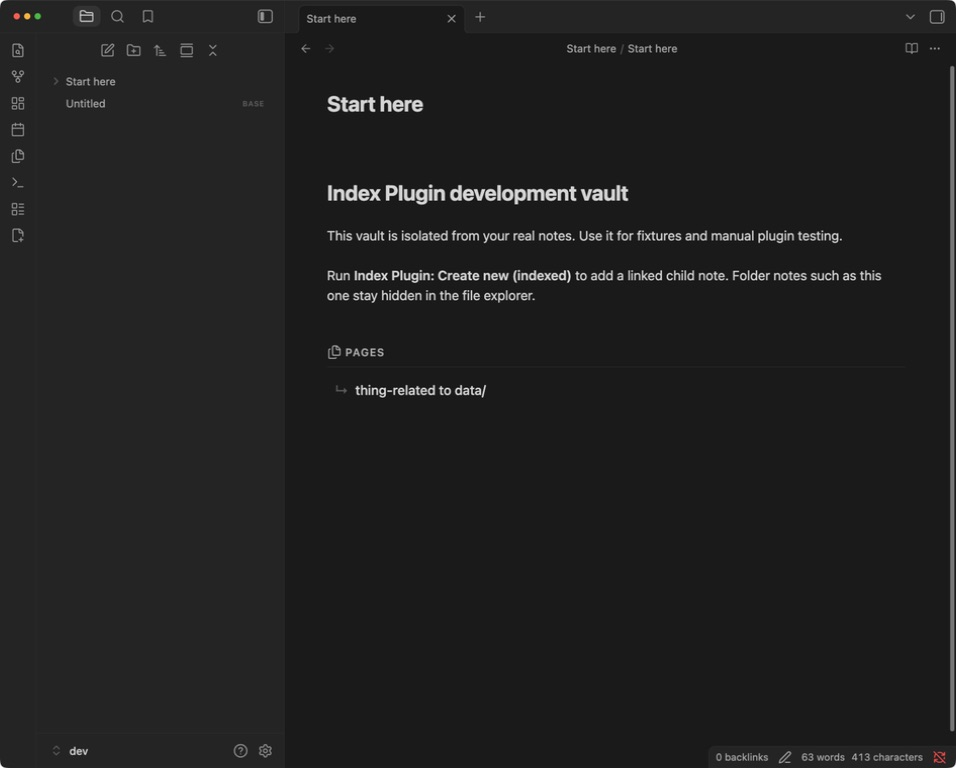
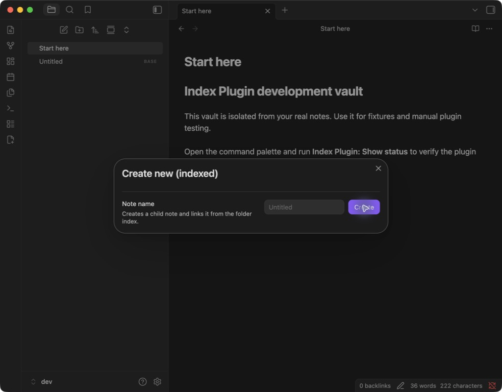

# Index Plugin

Make folders behave like notes in Obsidian.

Index Plugin gives an indexed folder its own Markdown document, opens that document when you click the folder, and keeps a polished list of the folder's contents up to date automatically.



## Features

- **Folders open like notes.** Click a folder name to open its document; use the chevron to expand or collapse it.
- **Automatic Pages list.** Direct child notes and subfolders appear in a styled, naturally sorted list and stay synchronized as files change.
- **One name everywhere.** `Projects/Projects.md` represents the `Projects` folder. Rename the folder or its visible note title and the other follows.
- **Useful Graph View nodes.** Folder notes use real folder names instead of a sea of files called `index`.
- **Note-to-folder conversion.** Run **Create new (indexed)** on `Project.md` to turn it into `Project/Project.md` and create a linked child note.
- **Safe existing-folder adoption.** **Convert (indexed)** preserves existing Markdown, whether it starts from `Folder/Folder.md` or a legacy `Folder/index.md`.
- **Preview-first tree migration.** Migrate an existing folder hierarchy with a depth limit, automatic backups, conflict reporting, and optional cleanup of empty sidecar duplicates.
- **Managed roots.** Keep automatic indexing and same-name-note adoption inside selected folder trees without touching deeper attachment or project directories.
- **Quiet internals.** Plugin ownership properties, update markers, and owned folder-note files stay out of the way in Obsidian's interface.
- **User content stays yours.** The plugin rewrites only its marked Pages block and leaves headings, prose, and user properties untouched.



## How folder notes work

An indexed folder and its document share a name:

```text
Projects/
├── Projects.md
├── Roadmap.md
└── Research/
    └── Research.md
```

The owned Markdown file is hidden in File Explorer, so the folder appears as one object. Its internal metadata identifies it precisely; unrelated same-name notes and ordinary `index.md` files are never hidden automatically.

Nested folder notes follow the same convention. Breadcrumbs collapse the duplicated folder/file segment, while links and Graph View retain meaningful note names.

## Plugin commands

- **Create new (indexed)** — create a linked child note, converting the current note into a folder first when needed.
- **Convert (indexed)** — adopt or create the selected folder's note without replacing existing content.
- **Migrate folder tree (indexed)…** — preview, back up, and convert a selected folder and its descendants.
- **Open folder index** — open the selected folder's note.
- **Initialize indexes for all folders** — explicitly convert every existing non-root folder.

## Development

```bash
npm install
npm run setup
npm run dev
```

Open `dev/` as an Obsidian vault and enable community plugins if prompted. The setup command installs [Hot-Reload](https://github.com/pjeby/hot-reload) and links `dist/` into the vault.

- `npm run dev` — prepare the dev vault and rebuild on changes.
- `npm run check` — lint, test, type-check, and build.
- `npm run build` — create minified release files in `dist/`.
- `npm version patch|minor|major` — update package, manifest, and compatibility versions together.

Release assets are `dist/main.js`, `dist/manifest.json`, and `dist/styles.css`.
